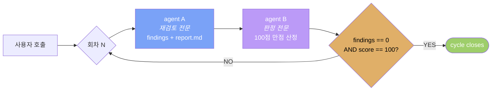
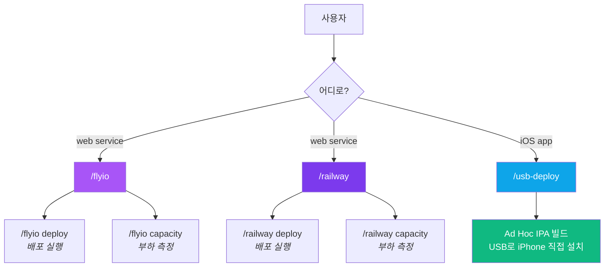
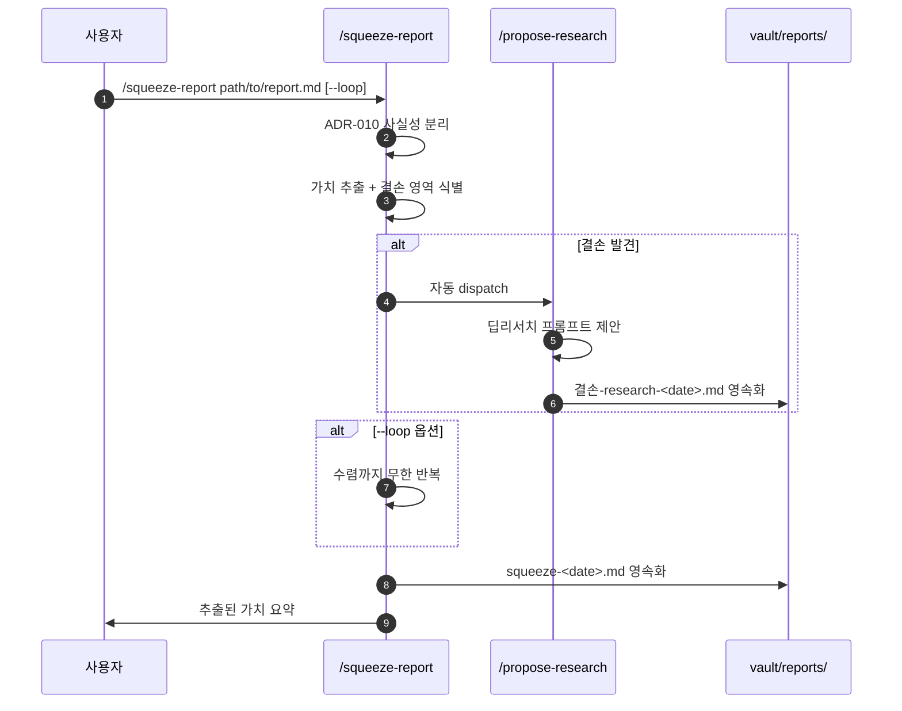

<div align="center">

# claude-code-commands

### 1년치 누적된 Claude Code 커스텀 슬래시 명령 20종

**자가 점검 루프 · 배포 자동화 · 외부 보고서 가치 추출 · 도메인 결손 점검 · 외부 API 연동**<br/>
모두 한 줄로 호출. 모두 산출물을 파일로 영속화. 모두 사용자 질문 없이 즉시 실행.

<br/>

[](#-카탈로그)
[](#-카탈로그)
[](LICENSE)
[](https://docs.claude.com/en/docs/claude-code)
[](#-공통-설계-철학)

[](#-자가-점검-루프-6종)
[](#-배포-자동화-7종)
[](#-외부-보고서-가치-추출-2종)
[](#-도메인-결손-점검-1종)
[](#-외부-api-연동-4종)

<br/>



</div>

---

<div align="center">

## ⚡ 30초 안에 이해하기

</div>

```text
사용자 →  /check
           │
           ▼
        agent A (재검토 전문)  ──►  report.md (findings)
           │
           ▼
        agent B (판정 전문)    ──►  score / decision
           │
           ▼
        findings == 0  AND  score == 100 ?
           │
           ├─ NO   →  round++   →  spawn fresh agent A  (loop)
           └─ YES  →  cycle closes
                       │
                       ▼
사용자 ◄  최종 보고서.md
```

**핵심 발명**: 6개 점검 명령(`/check` `/flow` `/guarantee` `/more` `/retry` `/strengthen`)이 같은 sentence를 공유한다 —

> **"100점 + 0건 발견까지 회차 반복. 같은 에이전트가 점검·판정하지 않는다."**

이 패턴이 9회차로 누적·확장된 결과물이 [harness107](https://github.com/Technoetic/harness107)의 200+ 안전 패턴이다.

---

<div align="center">

## 🗂 카탈로그

</div>

| 카테고리 | 수 | 시그니처 패턴 |
|:---|:---:|:---|
| [🔄 **자가 점검 루프**](#-자가-점검-루프-6종) | 6 | A·B 두 서브에이전트 + 100점/0건까지 회차 반복 |
| [🚀 **배포 자동화**](#-배포-자동화-7종) | 7 | Fly.io · Railway · USB iOS — 단일 호출 완결 |
| [📊 **외부 보고서 가치 추출**](#-외부-보고서-가치-추출-2종) | 2 | 보고서 → ADR 분리 → 결손 영역 자동 dispatch → 수렴까지 무한 |
| [🎯 **도메인 결손 점검**](#-도메인-결손-점검-1종) | 1 | N 도메인 자동 점검 → 우선순위 매트릭스 영속화 |
| [🔌 **외부 API 연동**](#-외부-api-연동-4종) | 4 | BizRouter · Gamma · GitHub CLI · 시각 검증 자동 수정 |

---

<div align="center">

## 🔄 자가 점검 루프 6종

[`self-audit-loops/`](self-audit-loops/)

</div>

> [!IMPORTANT]
> 같은 명령 호출만 6번 — 점검 *대상*만 다르다. **사고 방식 자체를 슬래시 명령으로 박제**한 결과.

| 명령 | 점검 대상 | 한 줄 |
|:---|:---|:---|
| [`/check`](self-audit-loops/check.md) | 이해도 | 지금까지 대화 내용을 100% 이해했는가 |
| [`/flow`](self-audit-loops/flow.md) | 흐름·순서·논리 | 파일·코드·문서·작업의 흐름에 이상이 없는가 |
| [`/guarantee`](self-audit-loops/guarantee.md) | 보장성 | 완료된 모든 작업을 100% 보장할 수 있는가 |
| [`/more`](self-audit-loops/more.md) | 미완 | 더 할 것이 없는가 |
| [`/retry`](self-audit-loops/retry.md) | 불가 판정 | "절대 못 한다"는 결론이 실제로 불가능한가 |
| [`/strengthen`](self-audit-loops/strengthen.md) | 보강 여지 | 보강할 것이 없는가 |

### 공통 4단계 절차



### 종료 불변식

- `findings == 0` **AND** `score == 100` → 종료
- 1건이라도 발견 / 100점 미달 → 즉시 다음 회차 dispatch
- **agent A ≠ agent B** — 자기 자신을 판정하는 것 차단

### 사용 예

```text
/retry
→ [못해 점검 1회차]
→ agent A 스폰: 7개 미확인 우회 경로 → 4개 발견 → 즉시 패치 → 재시도: YES
→ agent B 판정: -40점, 다음 회차 필요
→ [못해 점검 2회차] …
→ … (9회차에 사이클 종료)
```

> [!NOTE]
> 이 정확한 패턴을 9회차까지 돌린 결과가 [Technoetic/harness107](https://github.com/Technoetic/harness107)의 200+ 안전 패턴 누적이다. **사고 방식이 슬래시 명령으로 박제되고, 그것이 또 다른 도구로 진화한다.**

---

<div align="center">

## 🚀 배포 자동화 7종

[`deploy/`](deploy/)

</div>

3개 배포 채널(Fly.io · Railway · iOS USB Ad Hoc)을 단일 호출로.



| 명령 | 채널 | 역할 |
|:---|:---|:---|
| [`/flyio`](deploy/flyio.md) | Fly.io | 배포·관리 + 다른 PC 부트스트랩 통합 |
| [`/flyio deploy`](deploy/flyio-deploy.md) | Fly.io | 단일 호출 배포 완결 |
| [`/flyio capacity`](deploy/flyio-capacity.md) | Fly.io | 동시 접속 한계 측정·보고 |
| [`/railway`](deploy/railway.md) | Railway | 배포·관리 통합 |
| [`/railway deploy`](deploy/railway-deploy.md) | Railway | GitHub 연동 또는 CLI 직접 배포 |
| [`/railway capacity`](deploy/railway-capacity.md) | Railway | 부하 테스트 + 동시 접속 한계 |
| [`/usb-deploy`](deploy/usb-deploy.md) | iOS | TestFlight 우회 Ad Hoc IPA + USB 직접 설치 |

---

<div align="center">

## 📊 외부 보고서 가치 추출 2종

[`research-pipeline/`](research-pipeline/)

</div>

ChatGPT·Gemini·Claude 등이 만든 **외부 LLM 보고서**를 받아 본 시스템에 녹이는 파이프라인.



| 명령 | 역할 |
|:---|:---|
| [`/squeeze-report`](research-pipeline/squeeze-report.md) | 외부 보고서에서 ADR-010 사실성 분리 → 가치 추출 → 결손 영역 시 `/propose-research` 자동 dispatch (`--loop` 옵션 시 수렴까지 무한) |
| [`/propose-research`](research-pipeline/propose-research.md) | 본 시스템 결손 영역 점검 + 딥리서치 프롬프트 제안 + `.md` 영속화 |

### 사용 예

```text
/squeeze-report /path/to/external-report.md --loop
→ ADR-010 사실성 점검: 12개 주장 중 3개 미검증
→ 결손 영역 3건 발견 → /propose-research 자동 dispatch
→ 딥리서치 프롬프트 3종 생성 → vault/reports/propose-2026-05-30.md
→ 수렴 회차 2: 결손 1건 → 재시도
→ 수렴 회차 3: 결손 0건 → 종료
→ vault/reports/squeeze-2026-05-30.md
```

---

<div align="center">

## 🎯 도메인 결손 점검 1종

[`domain/`](domain/)

</div>

| 명령 | 역할 |
|:---|:---|
| [`/domain-priorities`](domain/domain-priorities.md) | N 도메인 결손 영역 자동 점검 → **우선순위 매트릭스** + 시급 지식 리스트업 → `vault/reports/domain-priorities-<date>.md` 영속화 |

### 사용 예

```text
/domain-priorities
→ N 도메인 자동 스캔 (도메인 1·도메인 2·…·도메인 N)
→ 각 도메인별 결손 영역 + 우선순위 점수 산정
→ 우선순위 매트릭스 생성 ↓
```

| 도메인 | 결손도 | 시급성 | 점수 | 순위 |
|:---|:---:|:---:|:---:|:---|
| 도메인 1 | 8/10 | 9/10 | **17/20** | 🥇 TOP |
| 도메인 2 | 6/10 | 9/10 | 15/20 | 🥈 |
| 도메인 3 | 7/10 | 7/10 | 14/20 | 🥉 |
| … | … | … | … | … |

```text
→ vault/reports/domain-priorities-2026-05-30.md
```

---

<div align="center">

## 🔌 외부 API 연동 4종

[`integrations/`](integrations/)

</div>

| 명령 | 외부 시스템 | 역할 |
|:---|:---|:---|
| [`/bizrouter`](integrations/bizrouter.md) | BizRouter API | API 키 살아있고 호출 가능한지 사전 점검 |
| [`/gamma`](integrations/gamma.md) | Gamma API | 프레젠테이션 자동 생성 |
| [`/github`](integrations/github.md) | GitHub CLI | 이슈·PR·release 통합 가이드 |
| [`/verify`](integrations/verify.md) | Playwright + axe-core | 범용 시각 검증 + 자동 수정 루프 |

### `/verify` 예 — 시각 회귀 차단

```text
/verify http://localhost:5173

→ Playwright headless chromium 기동
→ 스크린샷 캡처 + axe-core 접근성 분석
→ 회귀 발견: 버튼 contrast 4.2:1 (WCAG AA 미달)
→ 자동 수정: --accent-primary #2563eb → #1d4ed8
→ 재검증: 4.51:1 ✓
→ 시각 회귀 0건까지 루프
```

---

<div align="center">

## 🧱 공통 설계 철학

</div>

| 원칙 | 의미 |
|:---|:---|
| **질문 금지** | 사용자에게 "어떻게 할까요?" 절대 묻지 않는다. 모호하면 결정 + 산출물에 1줄 사유 |
| **산출물 영속화** | 모든 명령은 `.md` 또는 `vault/reports/*-<date>.md`로 결과 파일을 남긴다 |
| **루프 패턴 내재** | 점검·평가·연구 명령은 모두 "0건 발견까지 회차 반복" 구조 |
| **A ≠ B 분리** | 점검 에이전트와 판정 에이전트를 분리 — 같은 에이전트 자가 판정 금지 |
| **subagent dispatch** | 메인 컨텍스트는 호출만, 실제 작업은 서브에이전트가 |
| **외부 채널 통합** | Fly.io · Railway · GitHub · BizRouter · Gamma · USB iOS 6채널 일관 호출 |

---

<div align="center">

## 🧬 영감 / 출처

</div>

| 출처 | 무엇을 빌렸나 |
|:---|:---|
| [Claude Code custom slash commands](https://docs.claude.com/en/docs/claude-code/slash-commands) | `~/.claude/commands/*.md` 메커니즘 자체 |
| [superpowers](https://github.com/anthropics/skills) | brainstorming·debugging skill 골격 (HARD-GATE는 무력화) |
| Obsidian vault `_규칙/` | 질문 금지·자연 종료 금지 헌법 |
| [MoAI-ADK](https://github.com/moai-research/MoAI) | EARS SPEC·@MX 4종 태그·TRUST 5 게이트 |

---

<div align="center">

## 🏗 자매 레포

</div>

| 레포 | 한 줄 |
|:---|:---|
| [**harness107**](https://github.com/Technoetic/harness107) | 본 레포의 self-audit 루프 패턴을 9회차 audit으로 진화시킨 결과 — 한 줄 요청으로 107 step 자율 실행하는 Claude Code 플러그인 |

---

<div align="center">

## 📦 설치

</div>

### 방법 1 — 전체 복사 (간단)

```bash
git clone https://github.com/Technoetic/claude-code-commands.git
cp -r claude-code-commands/{self-audit-loops,deploy,research-pipeline,domain,integrations}/*.md ~/.claude/commands/
```

### 방법 2 — 카테고리별 선택

```bash
# 자가 점검 루프만 필요
cp claude-code-commands/self-audit-loops/*.md ~/.claude/commands/

# 배포 자동화만 필요
cp claude-code-commands/deploy/*.md ~/.claude/commands/
```

### 방법 3 — 심볼릭 링크 (수정 추적)

```bash
ln -s "$(pwd)/claude-code-commands/self-audit-loops"/*.md ~/.claude/commands/
```

> [!TIP]
> 도메인 종속 명령(`/squeeze-report` `/propose-research` `/domain-priorities`)은 본 레포에서 `<your-domain>` `<your-app>` 등으로 일반화됨. 본인 프로젝트에 맞춰 치환하여 사용.

---

<div align="center">

## 📄 라이선스

[](LICENSE)

MIT License · Copyright (c) 2026 [Technoetic](https://github.com/Technoetic)

<br/>

**사고 방식이 슬래시 명령으로 박제되고, 그것이 또 다른 도구로 진화한다.**

<br/>

[](https://github.com/Technoetic/claude-code-commands/stargazers)
[](https://github.com/Technoetic/harness107)

</div>
